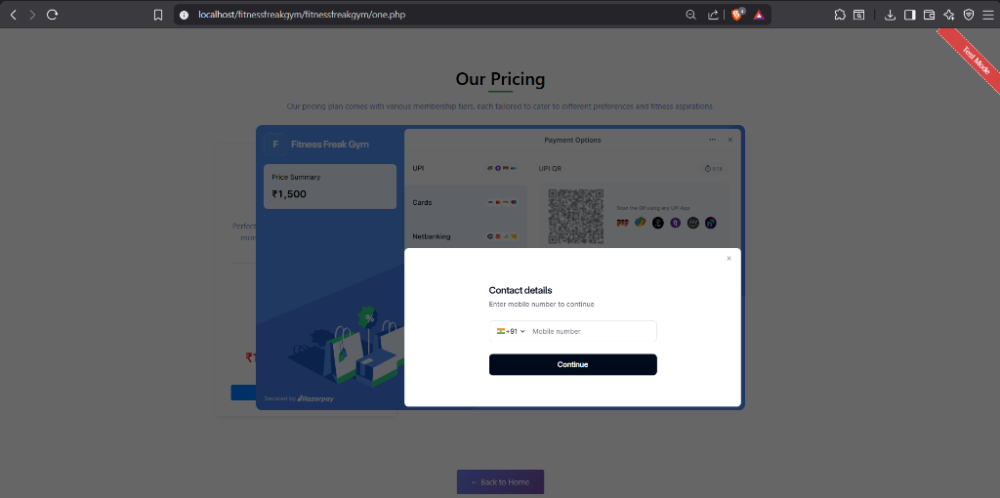

# Fitness Freak Gym - Management Portal

A web-based gym management system that handles user registration, member authentication, and online membership plan purchases. The system integrates the Razorpay API for handling transactions and provides a responsive dashboard for managing subscriptions.

## Features

*   **User Authentication & Security:** Secure login and registration flows featuring prepared SQL statements to prevent SQL injection and dynamic server-side validation.
*   **Payment Gateway Integration:** Direct membership payments integrated with the Razorpay API, supporting UPI, card transactions, and netbanking.
*   **Subscription Plans:** Three membership tiers (Monthly, Yearly, and 2-Year Premium) with individual payment routes.
*   **Responsive UI:** Clean dashboard design utilizing Bootstrap 4, optimizing layout responsiveness for mobile, tablet, and desktop screens.
*   **Contact & Location Map:** Location showcase with an embedded Google Map and an interactive contact module.

## Tech Stack

*   **Backend:** PHP 7+
*   **Database:** MySQL
*   **Frontend:** HTML5, CSS3, JavaScript (jQuery, RemixIcon)
*   **Payment API:** Razorpay API

## Installation & Setup

### Prerequisites
*   Local server environment (e.g., XAMPP, WampServer)
*   PHP 7.4 or higher
*   MySQL/MariaDB database server

### Step 1: Database Initialization
1. Start Apache and MySQL in your local server control panel.
2. Navigate to `http://localhost/phpmyadmin` in your web browser.
3. Create a new database named `fitnessgym`.
4. Import [fitnessgym.sql](file:///C:/xampp/htdocs/fitnessfreakgym/fitnessfreakgym/fitnessgym.sql) into the newly created database.

### Step 2: Configuration Setup
1. Copy the configuration template to create your active configuration file:
   ```bash
   cp config.sample.php config.php
   ```
2. Open `config.php` and configure your database and Razorpay credentials:
```php
// Database Configuration
define('DB_HOST', 'localhost');
define('DB_USER', 'root');
define('DB_PASS', ''); // Your local database password
define('DB_NAME', 'fitnessgym');

// Razorpay API Credentials
define('RAZORPAY_KEY_ID', 'YOUR_RAZORPAY_KEY_ID_HERE');
define('RAZORPAY_KEY_SECRET', 'YOUR_KEY_SECRET');
```

### Step 3: Deployment
1. Copy the project folder into your server's web root directory (e.g., `C:\xampp\htdocs\fitnessfreakgym`).
2. Open your browser and navigate to: `http://localhost/fitnessfreakgym/`

## Directory Structure

```
fitnessfreakgym/
├── Images/              # Image assets for UI components and background graphics
├── config.php           # Core configuration and database connection handler
├── index.php            # Portal login page (App landing page)
├── registration.php     # User signup form and validation logic
├── home.php             # User dashboard listing schedules, trainers, and plans
├── header.php           # Navigation layout and CSS dependencies
├── footer.php           # Footer elements, layout scripts, and Google Maps integration
├── one.php              # Monthly Plan checkout page (₹1,500)
├── two.php              # Yearly Plan checkout page (₹15,000)
├── three.php            # Premium Plan checkout page (₹25,000)
├── payment-process.php  # Processes validation parameters from the payment gate
├── success.php          # Checkout success verification page
├── contact.php          # Gym address, email, phone numbers, and map locator
├── logout.php           # Session destruction handler
├── mainpage.css         # Styling for home dashboard and checkout components
├── signup.css           # Styling for login and registration views
└── fitnessgym.sql       # Database schema export file
```

## Security Configurations

*   **Prepared Statements:** All dynamic queries inside database transactions use parameterized prepared queries via PHP's `mysqli` driver to protect against injection attacks.
*   **XSS Mitigation:** Inputs rendered to the browser are encoded using `htmlspecialchars()` to prevent client-side script injection.
*   **Session Guarding:** User dashboard routes (`home.php`) enforce check checks to verify active session keys before page rendering.

## Screenshots

| Home Dashboard | Razorpay Checkout |
|---|---|
|  |  |

## Planned Features (Roadmap)

The initial version focuses on user authentication and secure payment gateway integration. The following modules are planned for future development:
*   **Proper Membership Tracking Database:** Relational database updates to map active subscriptions and payment histories to specific user profiles.
*   **Admin Dashboard:** Dedicated control panel for gym owners to view member statistics, manage user accounts, and track revenues.
*   **Client Membership View:** A personalized user portal area showing active plan details, trainer assignments, and payment statuses.
*   **Automatic Expiry Calculations:** Dynamic date calculations computing remaining subscription days from the purchase date.
*   **Expiry Notifications:** System alerts to warn users on their dashboard when their memberships are close to expiration.

